# icve
### icve智慧职教MOOC学院新版/旧版自动刷视频脚本 [[最新版本为v0.0.5点击下载]](https://www.aliyundrive.com/s/nDLUnSwzrgS)[[淘宝接商单]](https://geeklanyu.taobao.com)
### 技术支持与意见反馈可直接在仓库建issues或者关注微信公众号“geeklanyu”留言或者联系邮箱“silence2021silence@163.com”。
### 免责声明：本程序仅供学习、研究与娱乐使用，使用本程序违反相关法律或相关规章制度的与作者无关，禁止用于任何商业用途。

# 使用说明：
## 1.普通用户
### 如果你不会敲代码，可以[点击这里](https://www.aliyundrive.com/s/nDLUnSwzrgS)直接下载发行版，即.exe可执行文件，下载好后完成相关配置，双击打开即可使用。
## 2.会搞Python的用户
### 会搞Python的兄弟可以下载.py文件然后安装相关的库来跑脚本。
#### 需要用到的库有：
#### pip install pyautogui
#### pip install opencv-python
#### pip install pillow

# 旧版MOOC配置步骤：
## 1.创建img文件夹，下载task.xls文件，并确保与.exe可执行文件在同一目录下，文件夹名和文件名不能错，否则会报错。
### 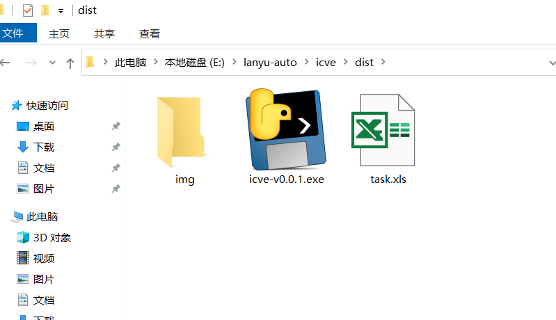
## 2.对要刷的章节、模块、任务进行截图采样，保存到img文件夹，注意文件名不能有中文。
### 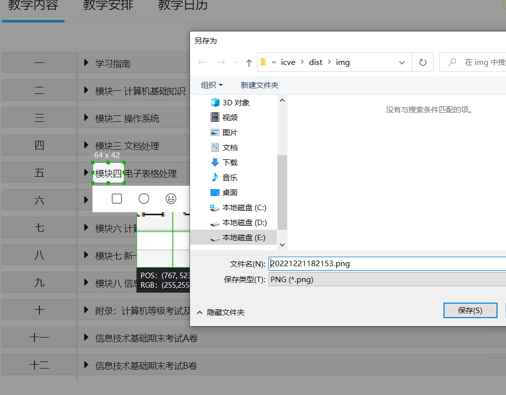
### 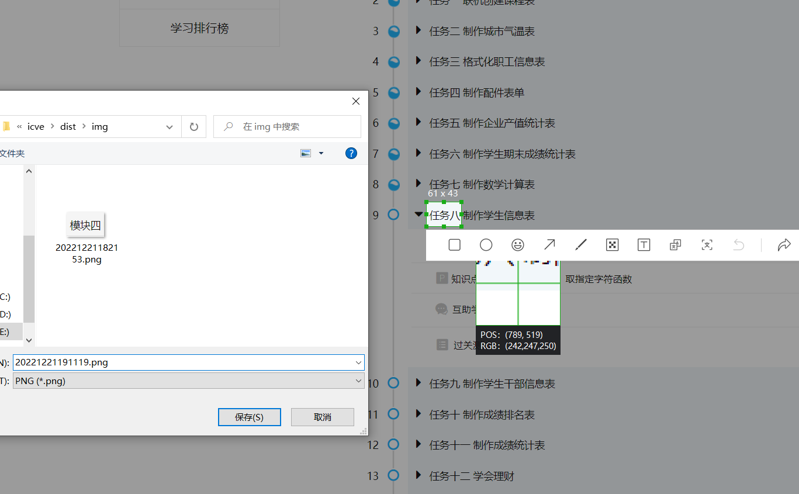
## 3.对微课开讲、访问验证、验证滑动条头部尾部、重播键、返回键、离开键进行截图采样，保存到img文件夹，注意文件名不能有中文。
### 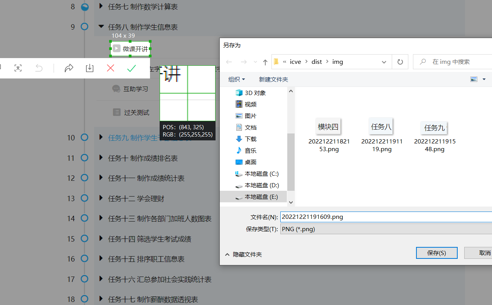
### 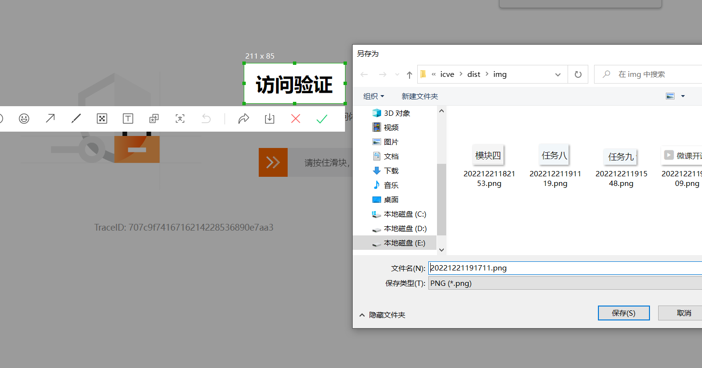
### 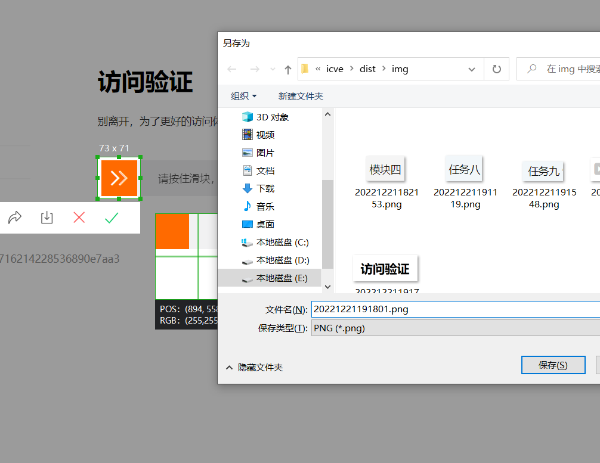
### 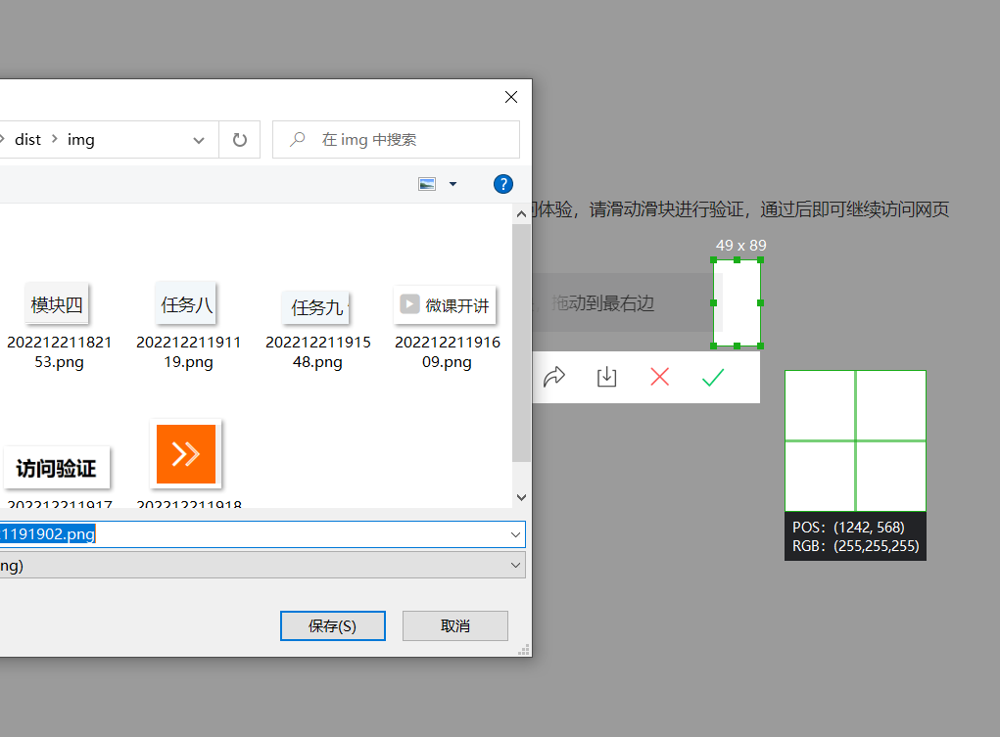
### 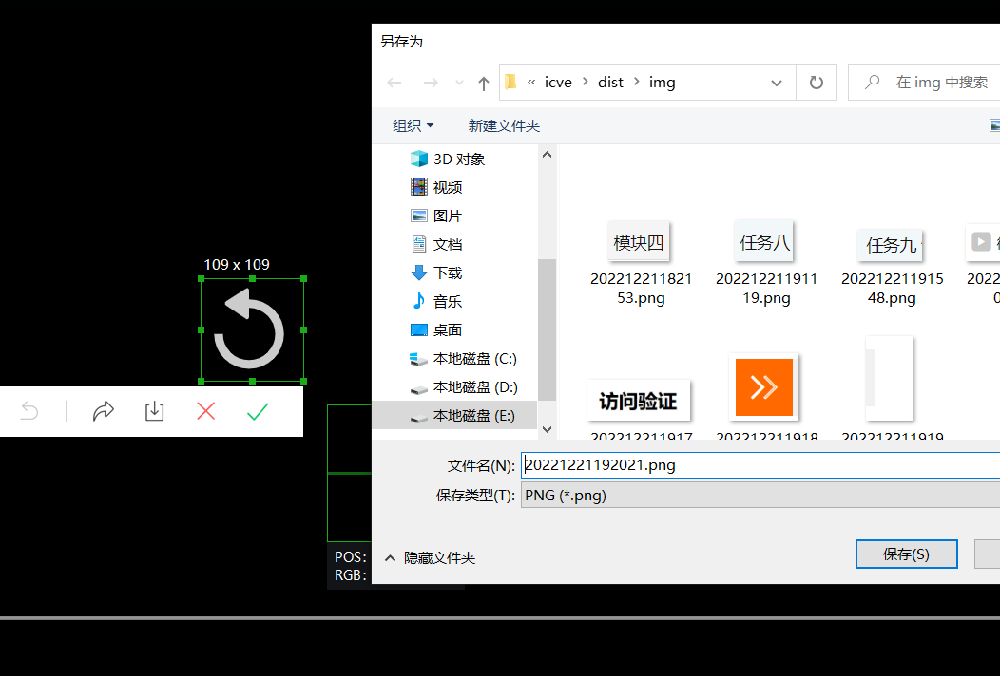
### 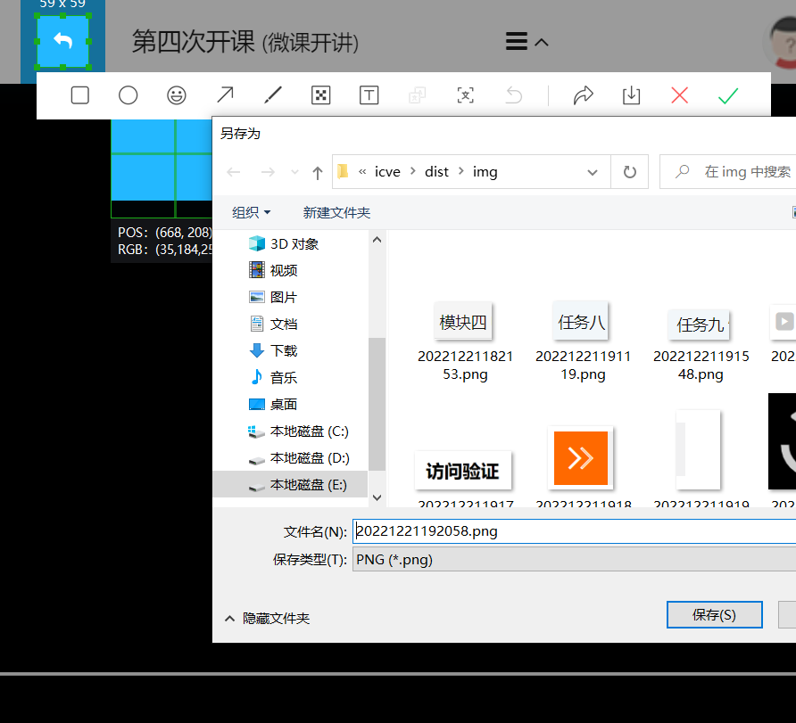
### 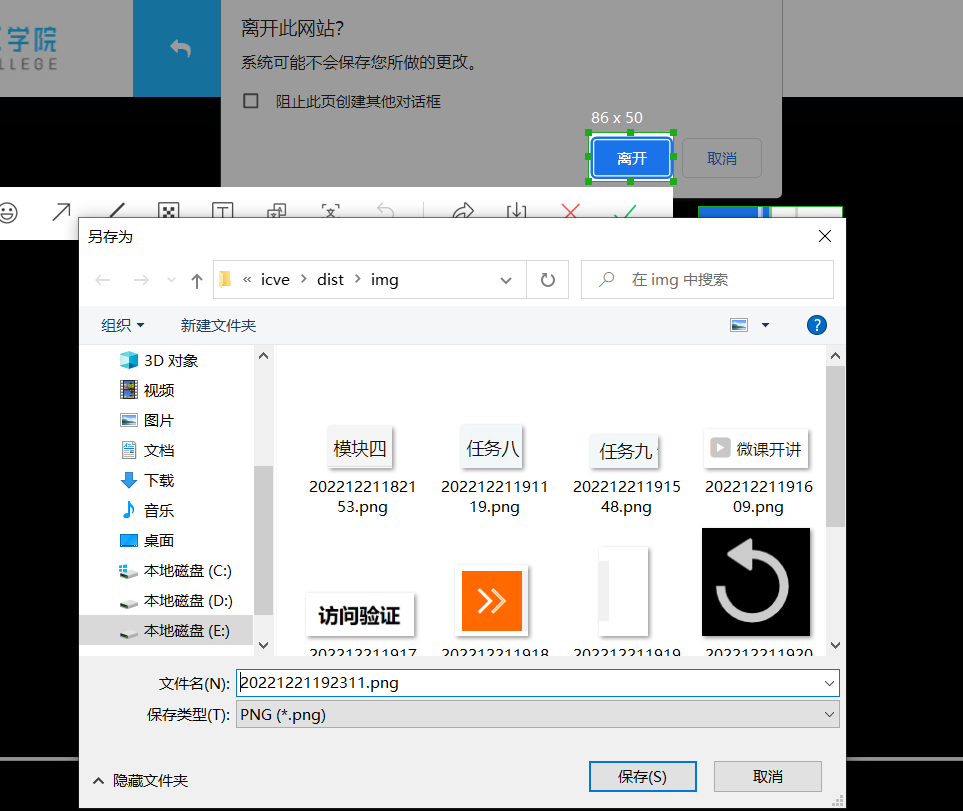
## 4.编辑task.xls文件，按要求把文件名填写到相应的单元格。要注意的是模块、任务必须按顺序(刷完模块一再到模块二，刷完任务一再到任务二)。还有就是表格里预留两个模块的位置，要刷多个模块的话可以在后面第4列第5列等等无限新建，但必须从第二格开始填，第二格填模块的采样图片，第三格及以下才开始填任务的采样图片。填完之后记得保存表格文件。温馨提示：采样图片可以重复使用。
### 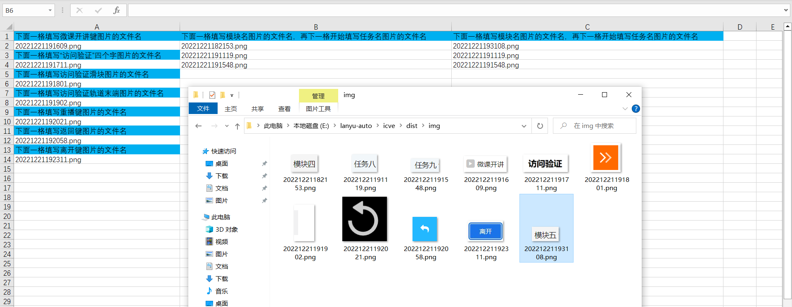
## 5.打开课程学习页面，注意要把所有的分支都折叠起来，然后再双击打开.exe可执行文件，然后最小化程序窗口，即可开始。
### 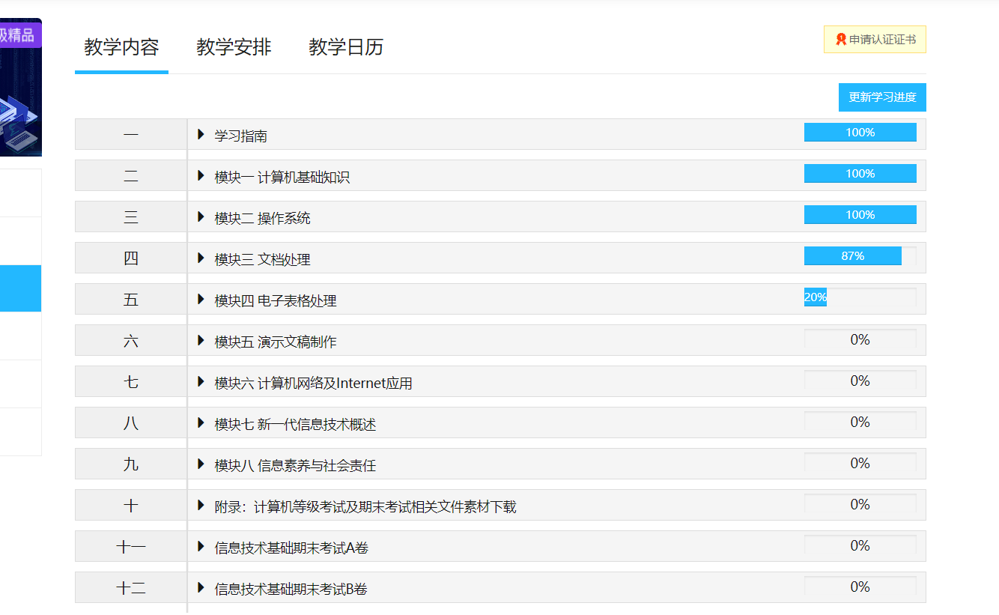

# 新版MOOC配置步骤：
## 请参考旧版MOOC的配置步骤
## 新版MOOC注意事项：
## 1.新版用的配置表格有所不同，旧版的表格文件名为task.xls，而新版的是task_new.xls，并且表格的内容也不一样，按照提示填写即可。
### 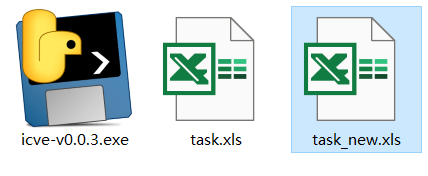
### 新版的表格
### 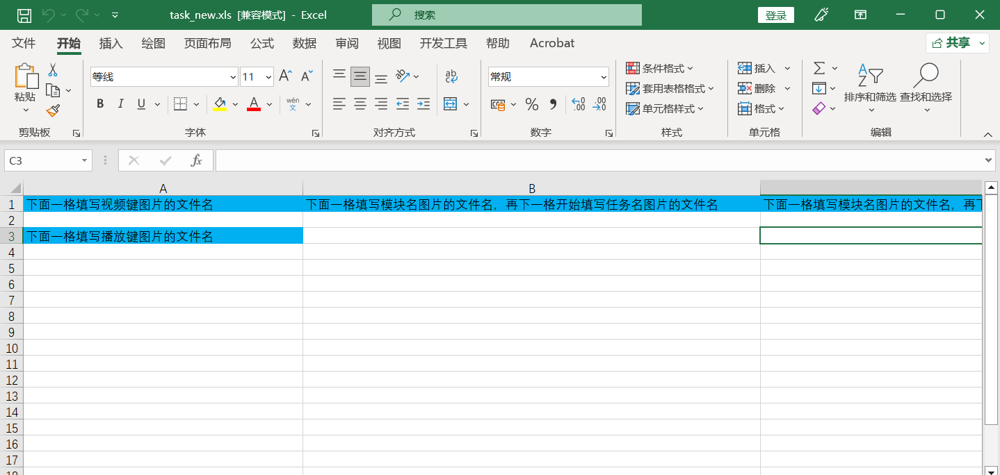
### 视频键采样
### 
### 播放键采样
### 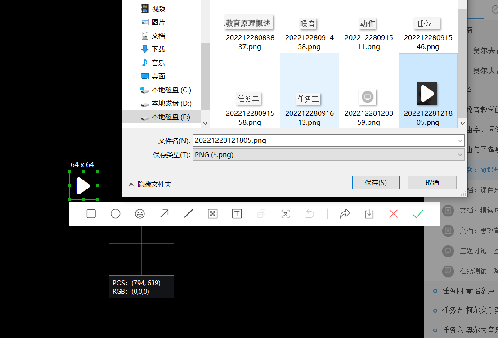
